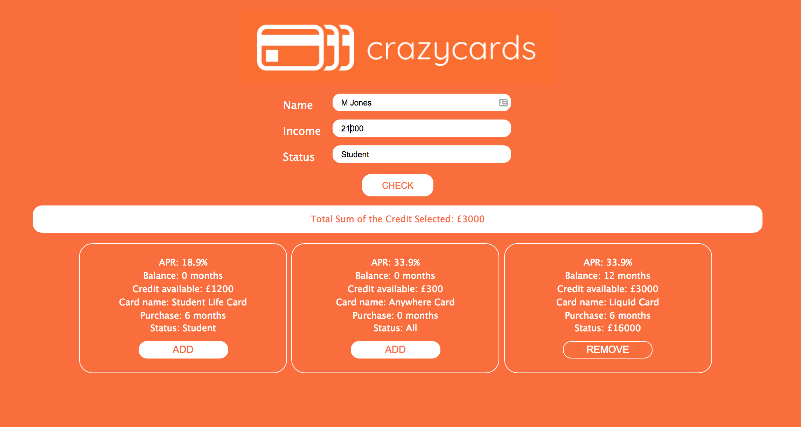

## Crazy Cards React app

### Project information

This app renders to the screen a list of credit cards allowed per user. The logic is testing for Status and Income data provided in the form

- All customers are entitled to cards with status: All
- Only those who enter Student in the form are entitled to cards with status: Student
- Finally only those who are earning a minimum of 16k are entitled to a card with status: 16000

Logic then collects card data object from each test above and return a collection for the app to render.
There is a TOTAL CREDIT counter which shows which cards are selected from given list by click on ADD button.
Button switches between ADD/REMOVE updating TOTAL CREDIT and changing the given card look & feel, state.

## Instruction
- git clone the project repo
- ```yarn install``` to install all dependencies
- ```yarn start``` to kickstart FE application
- type in data into the form, most important being Income: e.g. 17000, Status: Student

## Steps completed
- used functional and class React components
- used **create-react-app** to scaffold application
- used **node-sass-chokidar** to tranpile Sass to CSS on build, watch-css also included to transpile while developing

## To do
- add responsivness
- add some tests, app was not TDD-ed, some comments/ideas on what to test in __tests__ folder 
- BUG: selecting card with Rieck and changing to Edmundson keeps 'Anywhere Card' selected (shared by both customers), app should reset state after each Last Name submission
- form validation e.g. Name => String, Income => Number, Status => Student / Other dropdown?
- Name, Income 0, some Status required to see 'Anywhere Card' => validation for least criteria card
- check BEM CSS classes markup and corresponding Sass file CardChecker.scss - refactor like other files to include Sass '&' nesting

[Another similar app](https://github.com/maciejk77/tm-app) but with fixed logic, Express endpoints, Redux etc 

## Screenshot
